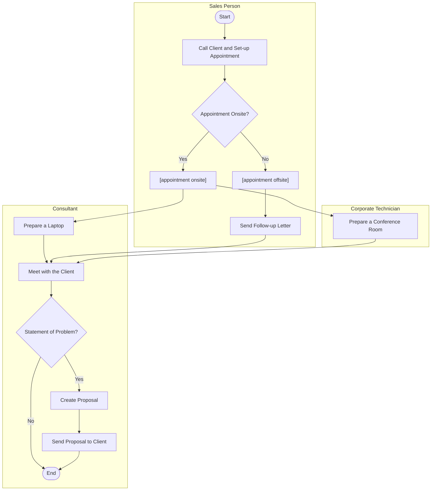

```mermaid
    flowchart TD
    subgraph Sales_Person["Sales Person"]
        Start([Start]) --> CallClient["Call Client and Set-up Appointment"]
        CallClient --> CheckAppointment{"Appointment Onsite?"}
        CheckAppointment -- Yes --> AppointmentOnsite["[appointment onsite]"]
        CheckAppointment -- No --> AppointmentOffsite["[appointment offsite]"]
        AppointmentOffsite --> FollowUp["Send Follow-up Letter"]
    end
    
    subgraph Consultant["Consultant"]
        AppointmentOnsite --> PrepareLaptop["Prepare a Laptop"]
        PrepareLaptop --> MeetClient["Meet with the Client"]
        FollowUp --> MeetClient
        MeetClient --> CheckProblem{"Statement of Problem?"}
        CheckProblem -- Yes --> CreateProposal["Create Proposal"]
        CheckProblem -- No --> End([End])
        CreateProposal --> SendProposal["Send Proposal to Client"]
        SendProposal --> End
    end
    
    subgraph Corporate_Technician["Corporate Technician"]
        AppointmentOnsite --> PrepareRoom["Prepare a Conference Room"]
        PrepareRoom --> MeetClient
    end

```