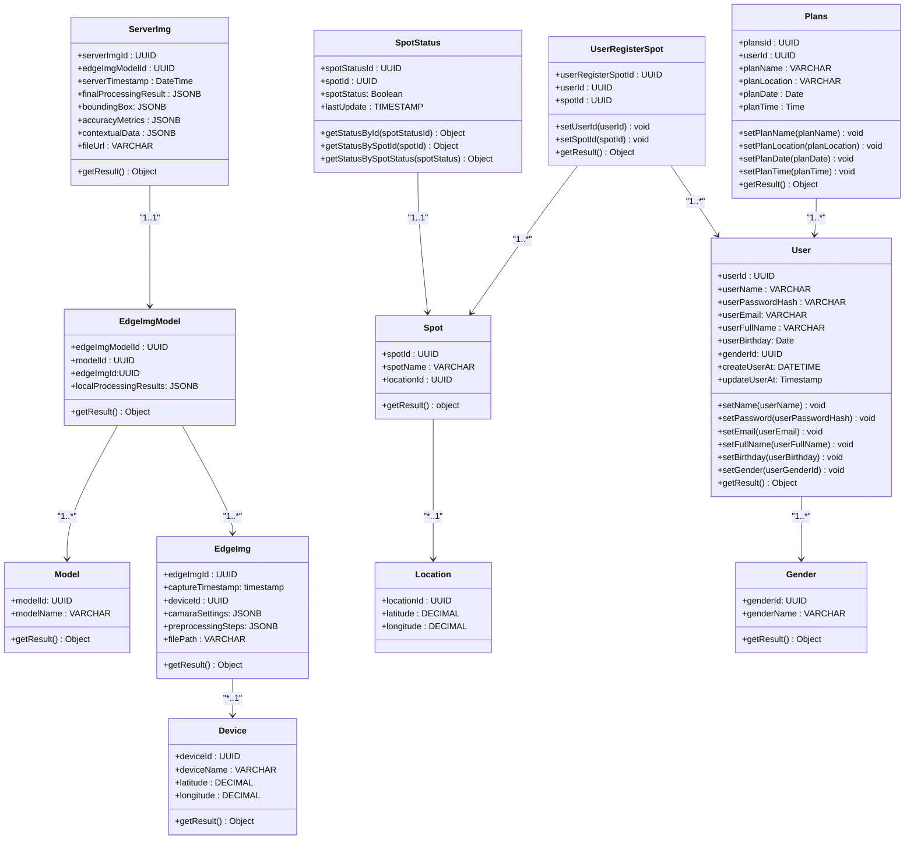

```mermaid
classDiagram
    class ServerImg {
        +serverImgId : UUID
        +edgeImgModelId : UUID
        +serverTimestamp : DateTime
        +finalProcessingResult : JSONB
        +boundingBox: JSONB
        +accuracyMetrics : JSONB
        +contextualData : JSONB
        +fileUrl : VARCHAR

        +getResult() Object
    }

    class EdgeImgModel {
        +edgeImgModelId : UUID
        +modelId : UUID
        +edgeImgId:UUID
        +localProcessingResults: JSONB
 
        +getResult() Object
    }

    class Model {
        +modelId: UUID
        +modelName : VARCHAR
     
        +getResult() Object
    }

    class EdgeImg {
        +edgeImgId : UUID
        +captureTimestamp: timestamp
        +deviceId : UUID
        +camaraSettings: JSONB
        +preprocessingSteps: JSONB
        +filePath : VARCHAR

        +getResult() Object
    }

    class Device {
        +deviceId : UUID
        +deviceName : VARCHAR
        +latitude : DECIMAL
        +longitude : DECIMAL

        +getResult() Object
    }

    class Location {
        +locationId : UUID
        +latitude : DECIMAL
        +longitude : DECIMAL 
    }

    class Spot { 
        +spotId : UUID 
        +spotName : VARCHAR
        +locationId : UUID 

        +getResult() object 
    }

    class SpotStatus {
        +spotStatusId : UUID 
        +spotId : UUID 
        +spotStatus: Boolean
        +lastUpdate : TIMESTAMP

        +getStatusById(spotStatusId) Object
        +getStatusBySpotId(spotId) Object
        +getStatusBySpotStatus(spotStatus) Object
    }

    class User {
        +userId : UUID 
        +userName : VARCHAR
        +userPasswordHash : VARCHAR
        +userEmail: VARCHAR
        +userFullName : VARCHAR
        +userBirthday: Date
        +genderId: UUID 
        +createUserAt: DATETIME
        +updateUserAt: Timestamp

        +setName(userName) void
        +setPassword(userPasswordHash) void
        +setEmail(userEmail) void
        +setFullName(userFullName) void
        +setBirthday(userBirthday) void
        +setGender(userGenderId) void
        +getResult() Object
    }

    class Gender {
        +genderId: UUID 
        +genderName : VARCHAR

        +getResult() Object
    }

    class Plans {
        +plansId : UUID 
        +userId : UUID 
        +planName : VARCHAR
        +planLocation : VARCHAR
        +planDate : Date
        +planTime : Time

        +setPlanName(planName) void
        +setPlanLocation(planLocation) void
        +setPlanDate(planDate) void
        +setPlanTime(planTime) void
        +getResult() Object
    }

    class UserRegisterSpot {
        +userRegisterSpotId : UUID 
        +userId : UUID 
        +spotId : UUID 

        +setUserId(userId) void
        +setSpotId(spotId) void
        +getResult() Object
    }

    ServerImg --> EdgeImgModel : "1..1"
    EdgeImgModel --> Model : "1..*"
    EdgeImgModel --> EdgeImg : "1..*"
    EdgeImg --> Device : "*..1"
    Spot --> Location : "*..1"
    SpotStatus --> Spot : "1..1"
    User --> Gender : "1..*"
    UserRegisterSpot --> User : "1..*"
    UserRegisterSpot --> Spot : "1..*"
    Plans --> User : "1..*"
```