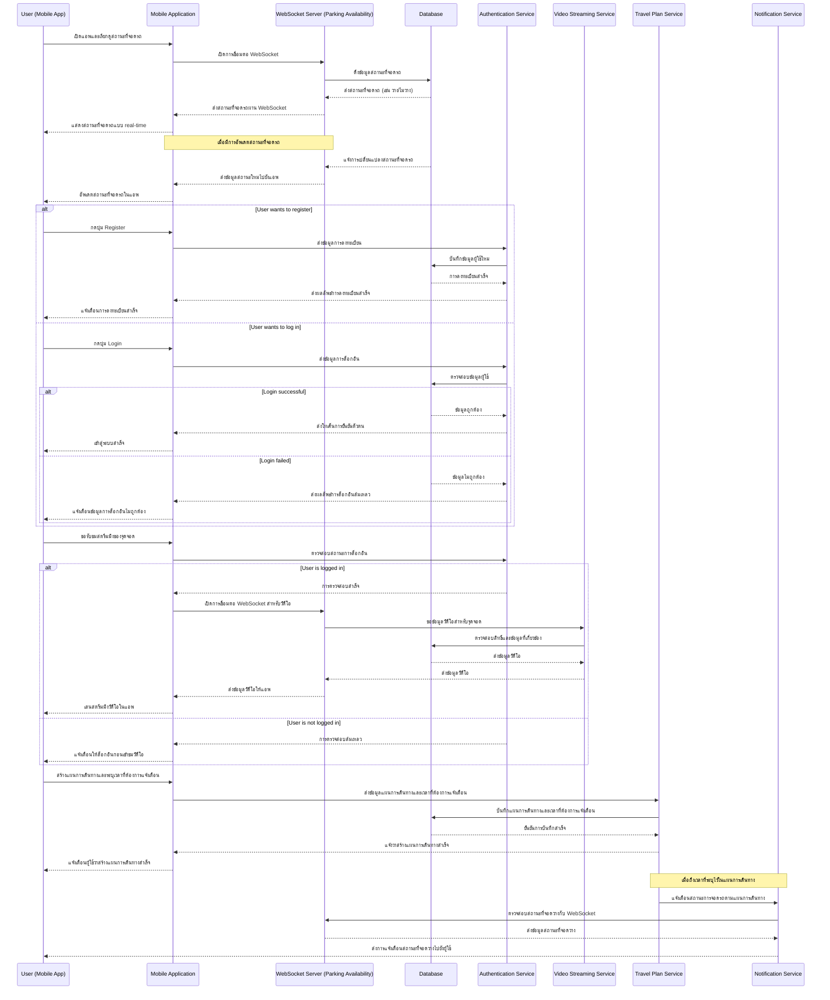

```mermaid
sequenceDiagram
    participant User as User (Mobile App)
    participant App as Mobile Application
    participant WS as WebSocket Server (Flask-SocketIO)
    participant DB as Database

    User ->> App: เปิดแอพและเรียกดูสถานะที่จอดรถ
    App ->> WS: เปิดการเชื่อมต่อ WebSocket
    WS ->> DB: ดึงข้อมูลสถานะที่จอดรถ
    DB -->> WS: ส่งสถานะที่จอดรถ (เช่น ว่าง/ไม่ว่าง)
    WS -->> App: ส่งสถานะที่จอดรถผ่าน WebSocket
    App -->> User: แสดงสถานะที่จอดรถแบบ real-time

    Note over WS, App: เมื่อมีการอัพเดตสถานะที่จอดรถ
    DB -->> WS: แจ้งการเปลี่ยนแปลงสถานะที่จอดรถ
    WS -->> App: ส่งข้อมูลสถานะใหม่ไปยังแอพ
    App -->> User: อัพเดตสถานะที่จอดรถในแอพ

    participant User as User (Mobile App)
    participant App as Mobile Application
    participant Auth as Authentication Service
    participant DB as Database

    alt User wants to register
        User ->> App: กดปุ่ม Register
        App ->> Auth: ส่งข้อมูลการลงทะเบียน
        Auth ->> DB: บันทึกข้อมูลผู้ใช้ใหม่
        DB -->> Auth: การลงทะเบียนสำเร็จ
        Auth -->> App: ส่งผลลัพธ์การลงทะเบียนสำเร็จ
        App -->> User: แจ้งเตือนการลงทะเบียนสำเร็จ
    else User wants to log in
        User ->> App: กดปุ่ม Login
        App ->> Auth: ส่งข้อมูลการล็อกอิน
        Auth ->> DB: ตรวจสอบข้อมูลผู้ใช้
        alt Login successful
            DB -->> Auth: ข้อมูลถูกต้อง
            Auth -->> App: ส่งโทเค็นการยืนยันตัวตน
            App -->> User: เข้าสู่ระบบสำเร็จ
        else Login failed
            DB -->> Auth: ข้อมูลไม่ถูกต้อง
            Auth -->> App: ส่งผลลัพธ์การล็อกอินล้มเหลว
            App -->> User: แจ้งเตือนข้อมูลการล็อกอินไม่ถูกต้อง
        end
    end


    participant User as User (Mobile App)
    participant App as Mobile Application
    participant Auth as Authentication Service
    participant WS as WebSocket Server
    participant Stream as Video Streaming Service
    participant DB as Database

    User ->> App: ขอรับชมสตรีมมิ่งของจุดจอด
    App ->> Auth: ตรวจสอบสถานะการล็อกอิน
    alt User is logged in
        Auth -->> App: การตรวจสอบสำเร็จ
        App ->> WS: เปิดการเชื่อมต่อ WebSocket สำหรับวิดีโอ
        WS ->> Stream: ขอข้อมูลวิดีโอสำหรับจุดจอด
        Stream ->> DB: ตรวจสอบสิทธิ์และข้อมูลที่เกี่ยวข้อง
        DB -->> Stream: ส่งข้อมูลวิดีโอ
        Stream -->> WS: ส่งข้อมูลวิดีโอ
        WS -->> App: ส่งข้อมูลวิดีโอให้แอพ
        App -->> User: เล่นสตรีมมิ่งวิดีโอในแอพ
    else User is not logged in
        Auth -->> App: การตรวจสอบล้มเหลว
        App -->> User: แจ้งเตือนให้ล็อกอินก่อนเข้าชมวิดีโอ
    end

    participant User as User (Mobile App)
    participant App as Mobile Application
    participant Plan as Travel Plan Service
    participant Notification as Notification Service
    participant DB as Database
    participant WS as WebSocket Server (Parking Availability)

    User ->> App: สร้างแผนการเดินทางและระบุเวลาที่ต้องการแจ้งเตือน
    App ->> Plan: ส่งข้อมูลแผนการเดินทางและเวลาที่ต้องการแจ้งเตือน
    Plan ->> DB: บันทึกแผนการเดินทางและเวลาที่ต้องการแจ้งเตือน
    DB -->> Plan: ยืนยันการบันทึกสำเร็จ
    Plan -->> App: แจ้งว่าสร้างแผนการเดินทางสำเร็จ
    App -->> User: แจ้งเตือนผู้ใช้ว่าสร้างแผนการเดินทางสำเร็จ

    Note over Plan, Notification: เมื่อถึงเวลาที่ระบุไว้ในแผนการเดินทาง
    Plan ->> Notification: แจ้งเตือนสถานะการจอดรถตามแผนการเดินทาง
    Notification ->> WS: ตรวจสอบสถานะที่จอดว่างกับ WebSocket
    WS -->> Notification: ส่งข้อมูลสถานะที่จอดว่าง
    Notification -->> User: ส่งการแจ้งเตือนสถานะที่จอดว่างไปยังผู้ใช้
```